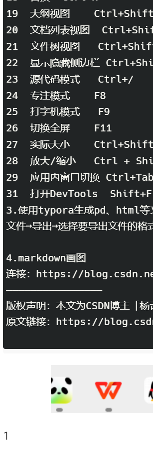
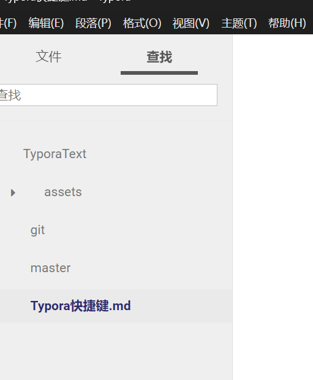

# Typora快捷键

1.typora常用快捷键
ctrl + / 切换编辑语法模式/预览模式

ctrl + 1 ~6 标题1~6 等同于
一级标题：#+空格+标题内容
二级标题：##+空格+标题内容
三级标题：###+空格+标题内容
……
最多六级标题

ctrl + B 粗体

ctrl + I 斜体

ctrl + T 表格

```+回车 代码块

引用：>+空格

转义字符： \ + 字符

无序列表：” - “+ 空格 或 “ * ” + 空格

有序列表：数字+“.”+空格

生成目录：[TOC]按回车

选中一整行：ctrl+l

选中单词：ctrl+d

选中相同格式的文字：ctrl+e

跳转到文章开头：ctrl+home

跳转到文章结尾：ctrl+end

搜索：ctrl+f

替换：ctrl+h

引用：输入>之后输入空格

代码块：ctrl+alt+f

加粗：ctrl+b

倾斜：ctrl+i

下划线：ctrl+u

删除线：alt+shift+5 或 ～～内容～～

分割线：- - - 或***

插入链接：ctrl+k

数学公式：$$ + enter

表情: :+单词+:

常用表情地址：https://www.webfx.com/tools/emoji-cheat-sheet/

目录：[toc] + enter

插入图片：直接拖动到指定位置即可或者ctrl+shift+i

图片可以直接拖进来，但是图片是相对路径，只能在本地使用，如果要放到博客中，要用绝对路径

链接可以直接把url复制上去

序号	类型	快捷键
1	删除线	alt+shift+5
2	下标	<sub>内容</sub>
3	上标	<sup>内容</sup>
4	脚注	[+^+脚注]
5	高亮	==内容==
6	着重	ctrl+shift+`
7	淡化	+内容+
8	转义	\ + 符号
9	清除格式	ctrl + \
10	居中	<center>+居中内容+<center>
11	右对齐	<p align=“right”>右对齐</p>
12	左对齐	<p align=“left”>右对齐</p>
13	换行	回车即可或者<br/>
14	空格（一个汉字俩空格）	 (一个空格) (两个空格推荐使用这个）
2.操作
序号	类型	快捷键
1	新建	Ctrl+N
2	新建窗口	Ctrl+Shift+N
3	打开	Ctrl+O
4	快速打开	Ctrl+P
5	保存	Ctrl+S
6	另存为	Ctrl+Shift+S
7	关闭	Ctrl+W
8	撤销	Ctrl+Z
9	重做	Ctrl+Y
10	复制为MarkDown	Ctrl+Shift+C
11	粘贴为纯文本	Ctrl+Shift+V
12	选中当前行/句	Ctrl+L
13	选中当前格式文本	Ctrl+E
14	选中当前词	Ctrl+D
15	跳转到文首	Ctrl+Home
16	跳转到文末	Ctrl+End
17	查找	Ctrl+F
18	替换	Ctrl+H
19	大纲视图	Ctrl+Shift+1
20	文档列表视图	Ctrl+Shift+2
21	文件树视图	Ctrl+Shift+3
22	显示隐藏侧边栏	Ctrl+Shift+L
23	源代码模式	Ctrl+/
24	专注模式	F8
25	打字机模式	F9
26	切换全屏	F11
27	实际大小	Ctrl+Shift+0
28	放大/缩小	Ctrl + Shift+ +/-
29	应用内窗口切换	Ctrl+Tab
31	打开DevTools	Shift+F12
3.使用typora生成pd、html等文件
文件→导出→选择要导出文件的格式

4.markdown画图
连接：https://blog.csdn.net/whatday/article/details/88655461
————————————————
版权声明：本文为CSDN博主「杨青葱」的原创文章，遵循CC 4.0 BY-SA版权协议，转载请附上原文出处链接及本声明。
原文链接：https://blog.csdn.net/LUSH_BOY/article/details/113731255

```


1

