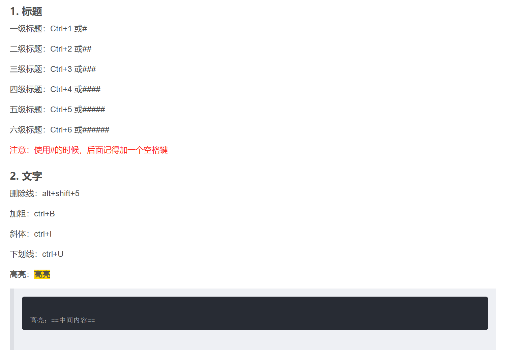
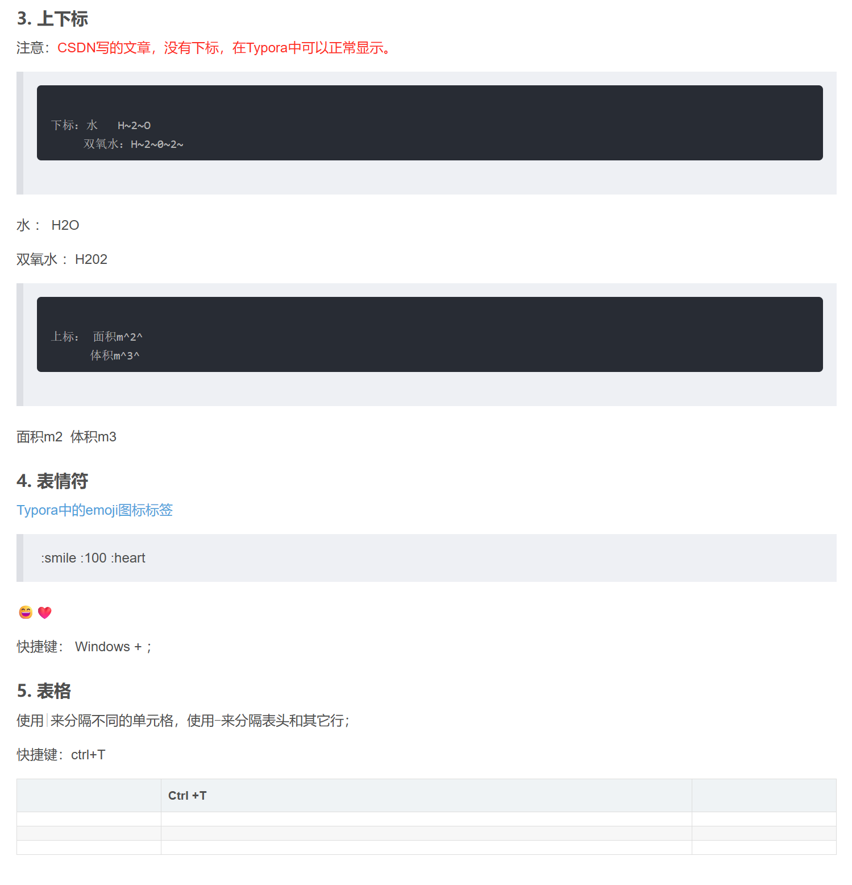
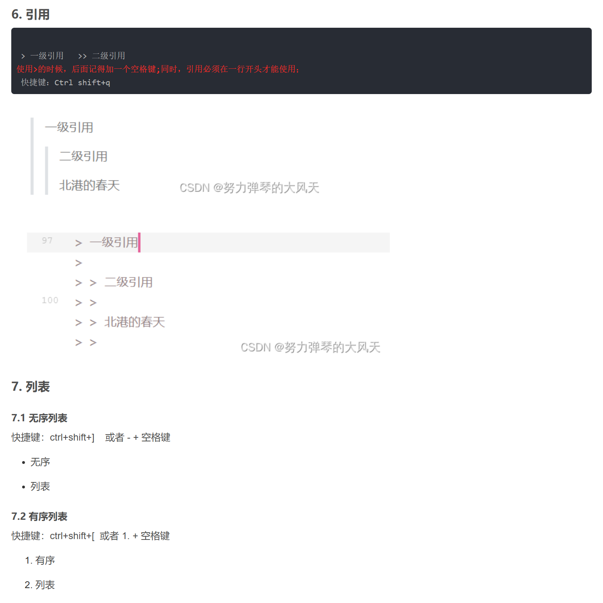
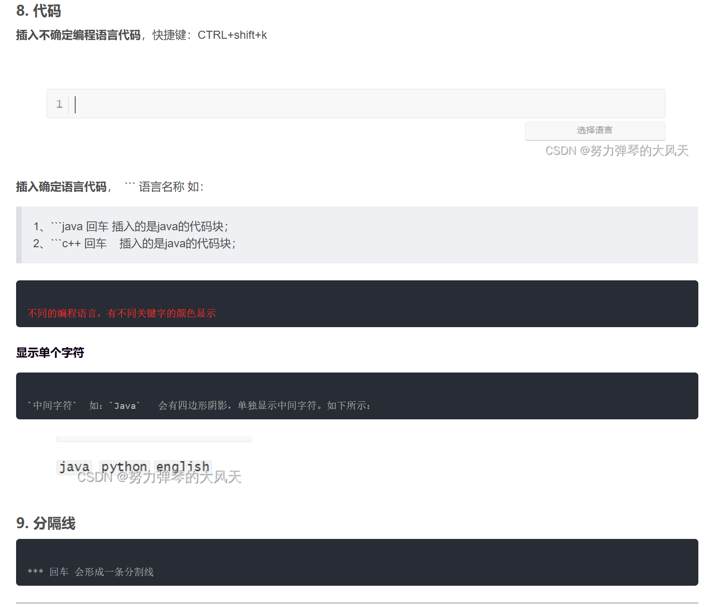
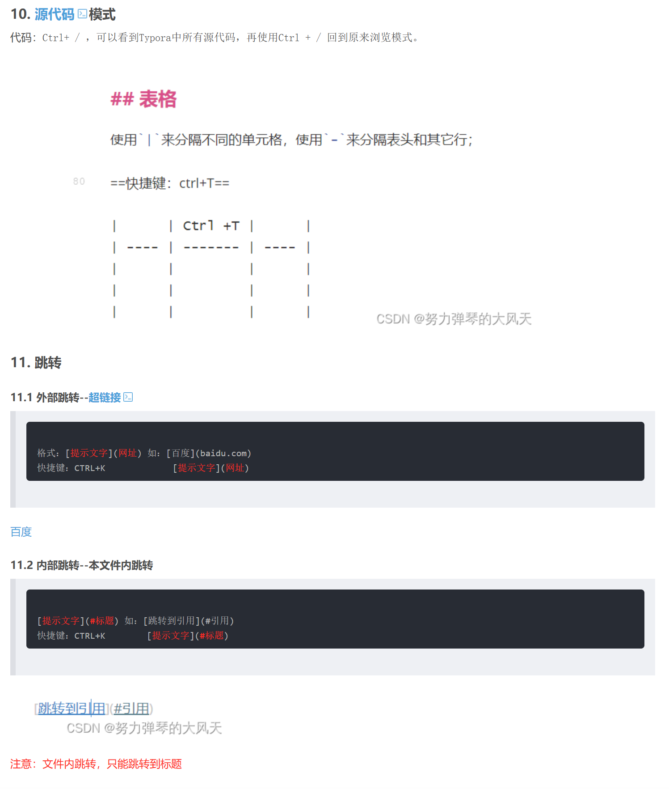
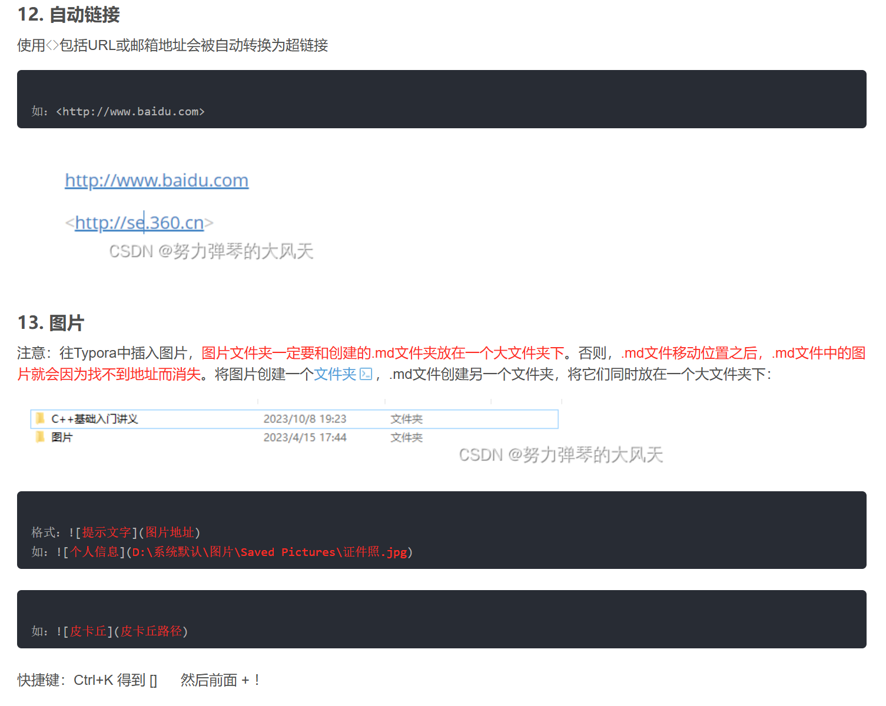
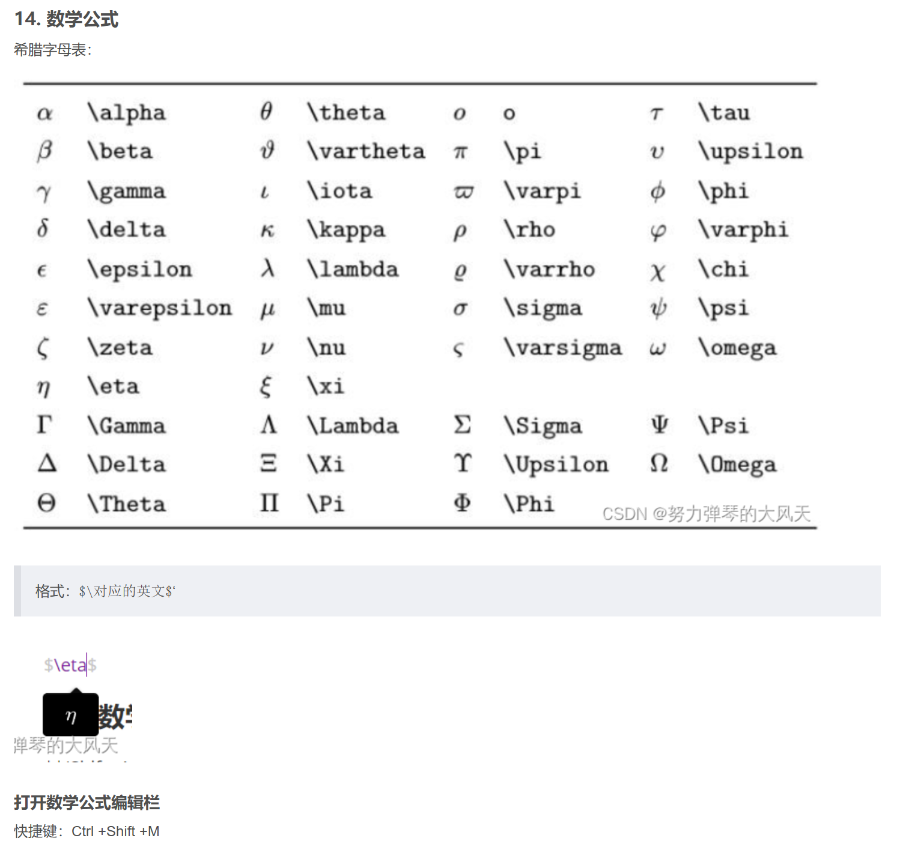
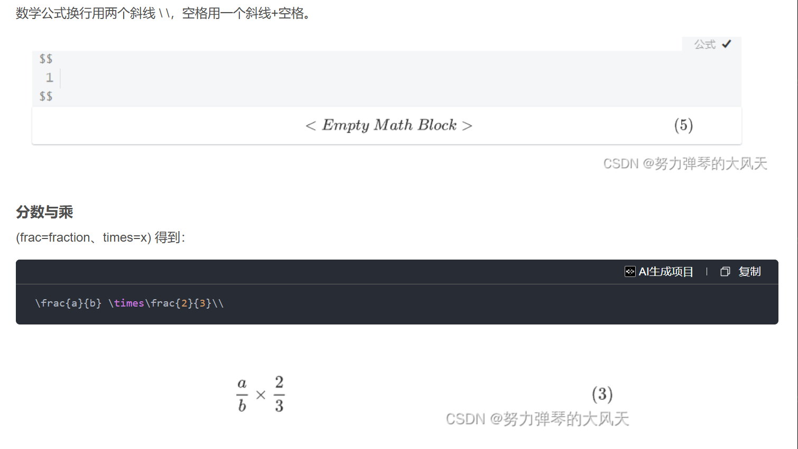

# 史上最全Typora教程----程序员必学软件之一

此处是官方提供学习文档：https://support.typora.io/

Typora是编程学习中，一个比较好用的软件。不管学C++、Python还是其它语言，都是一个不错的工具。

参考博客

Typora中的emoji图标标签   wise哲   Typora中的emoji图标标签-CSDN博客
————————————————
版权声明：本文为CSDN博主「努力弹琴的大风天」的原创文章，遵循CC 4.0 BY-SA版权协议，转载请附上原文出处链接及本声明。
原文链接：https://blog.csdn.net/m0_62648611/article/details/133713273