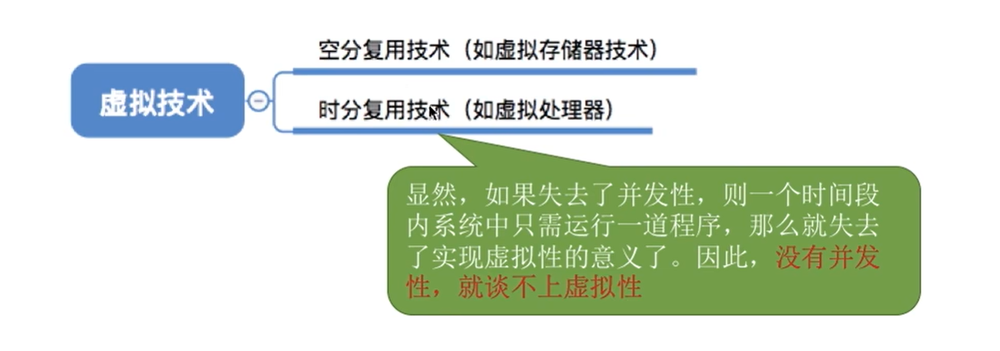
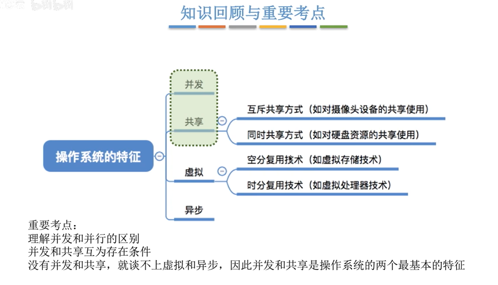

# 1.1 操作系统特征

并发，共享（两个基本特征），二者互为存在条件

### 并发

并发和并行：

**并发**：指两个或多个事件在同一时间间隔内发生。这些事件宏观上是同时发生的，但微观上是交替发生的。

**并行**：指两个或者多个事件在同一时刻同时发生。

### 共享

即共享资源，是指系统中的资源可供内存中多个并发执行的进程共同使用。

### 虚拟

虚拟是指把一个物理上的实体变成若干个逻辑上的对应物。物理实体（前者）使实际存在的，而逻辑上对应物（后者)是指用户感受到的。

### 异步

在多道程序下，允许多个程序并发执行，但由于资源有限，进程的执行不是一贯到底的，而是走停停的，以不可预知的速度向前推进，这就是进程的异步性。

### 知识点回顾

